# homelab-infrastructure

A self-hosted DevOps lab running on KVM/libvirt. Everything is defined as code — VMs, cluster config, monitoring, CI/CD pipelines, and alerting.

> **Highlight:** This lab includes a working Claude AI auto-healing system — when an alert fires, Claude diagnoses the root cause in real time and posts a one-click fix to Slack. No scripts, no runbook lookup, no SSH-ing into nodes. See [Alerting & Claude AI Auto-healing](#alerting--claude-ai-auto-healing) below.

---

## What this demonstrates

- **Full infrastructure-as-code lifecycle** — VM provisioning through Terraform, configuration via Ansible, container orchestration on k3s
- **Production-grade observability** — Prometheus, Grafana, Loki (31-day retention), Alertmanager with 20+ custom alert rules
- **Complete incident management pipeline** — alert fires → Slack notification with runbook link → GitLab issue auto-created → auto-closed on resolution
- **GitOps CI/CD** — lint, validate (kubeconform + promtool), security scan (gitleaks + kubesec), deploy, smoke test stages
- **Automated backups** — k3s SQLite snapshots every 12h, Vaultwarden SQLite hot-copy daily, GitLab full backup daily; all retained with configurable history
- **Security hardening** — NetworkPolicy default-deny, RBAC least-privilege ServiceAccounts, image SHA pinning, PodDisruptionBudgets, pod anti-affinity
- **Self-healing automation** — crashloop recovery cronjobs, health check scripts with auto-fix
- **Claude AI auto-healing** — Alertmanager fires → Claude reads live cluster state → diagnoses root cause → one-click Approve in Slack executes the fix automatically
- **Runbook library** — 13 runbooks covering control plane, nodes, storage, applications, monitoring, and full disaster recovery with RTO/RPO targets
- **Custom Python control plane** — TUI and menu-driven interface for full lab management

---

## Screenshots

**Cluster & App**

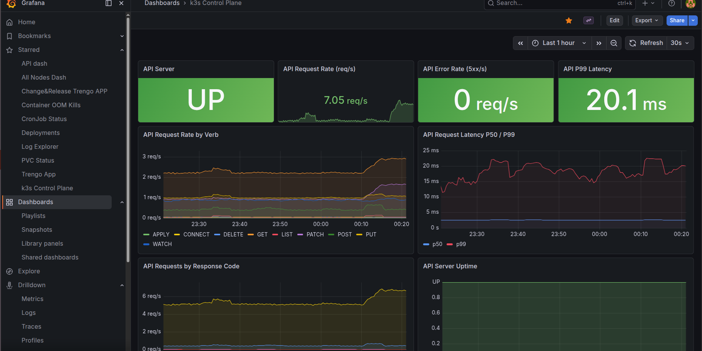
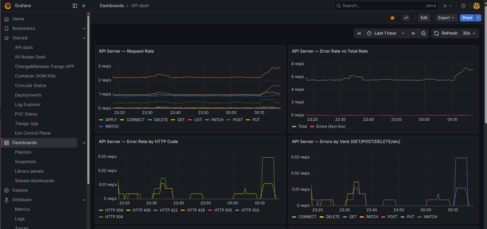
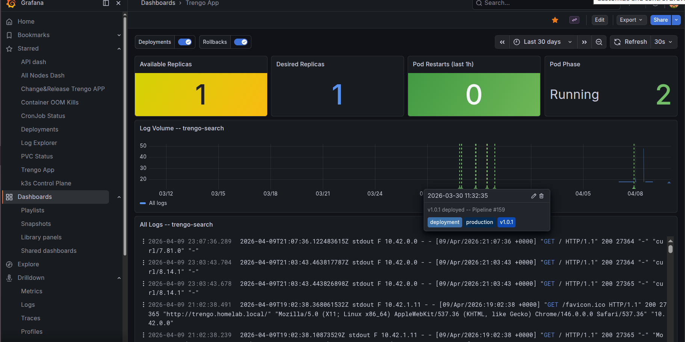

**Control & Health**

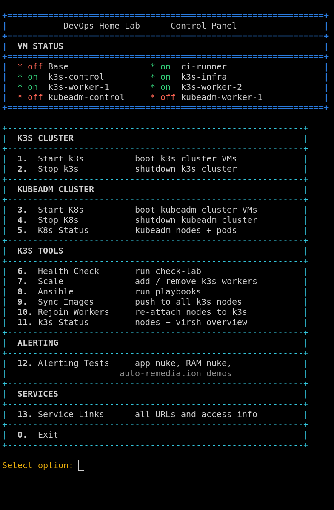
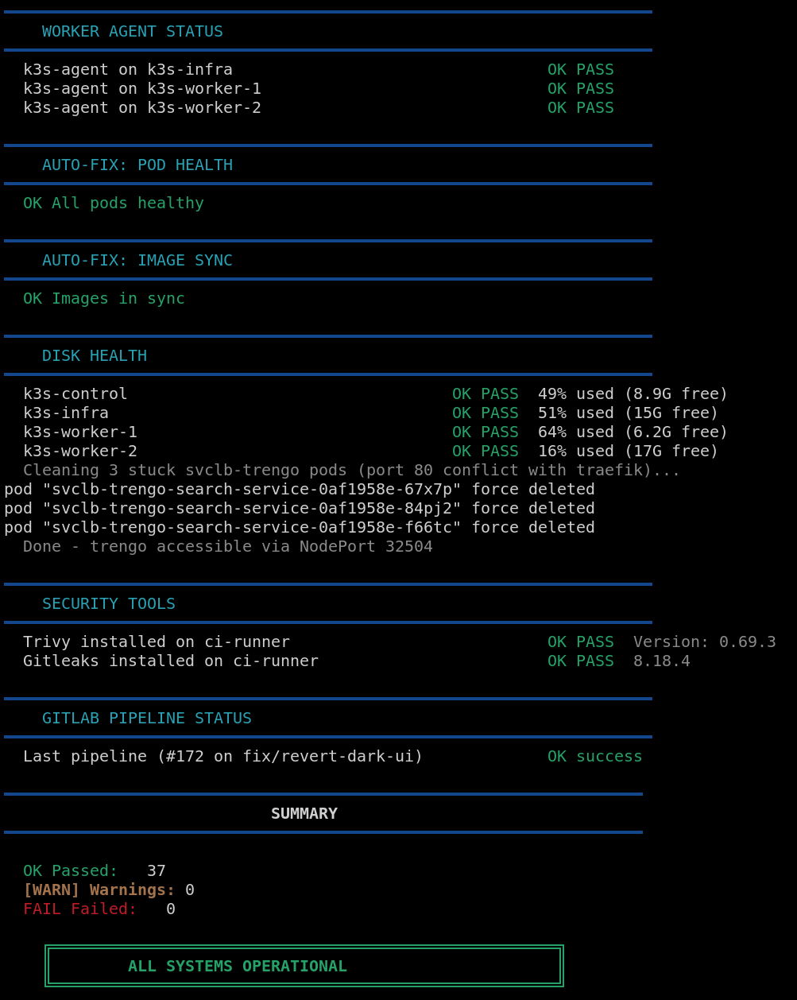

**CI/CD & GitLab**

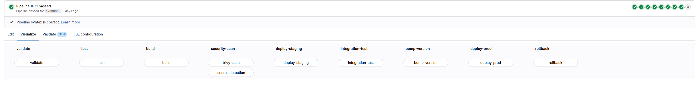
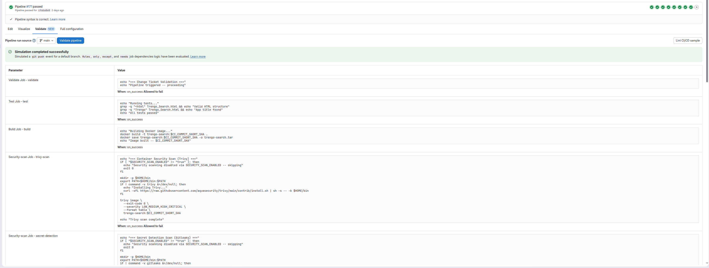
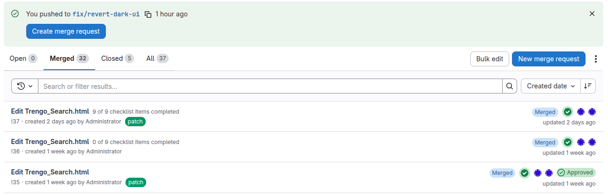
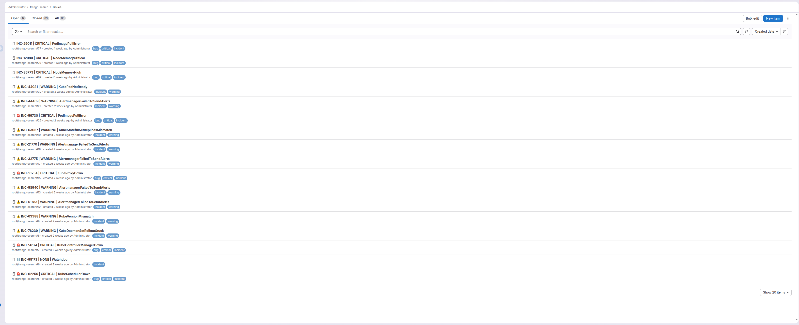

**Alerting**

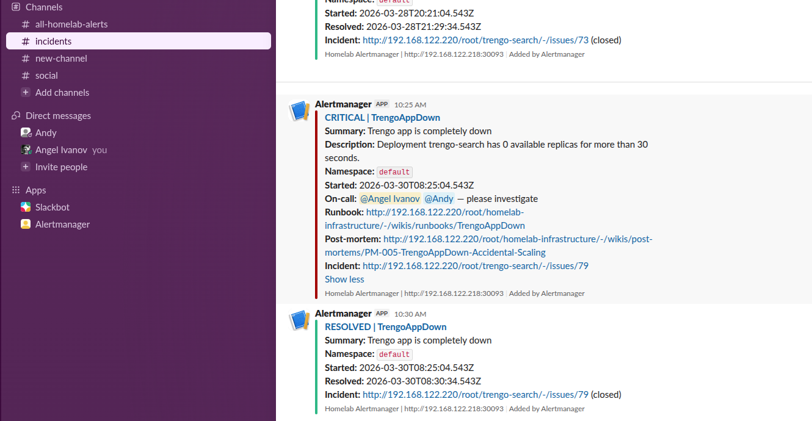

**Claude AI Auto-healing**

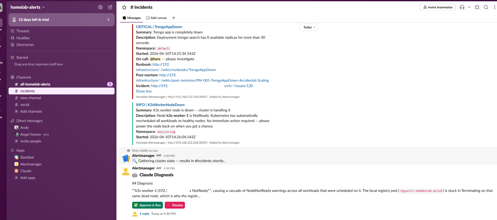
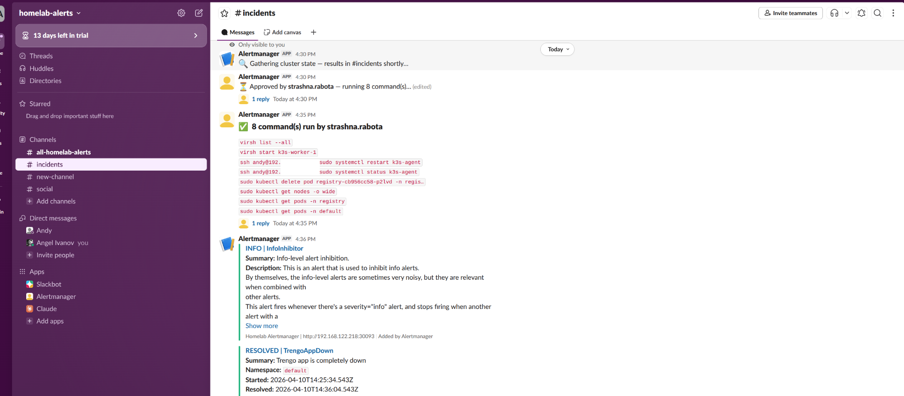

---

## What's in here

| Layer | Tech |
|---|---|
| VM provisioning | Terraform + libvirt provider |
| Configuration management | Ansible |
| Container orchestration | k3s (SQLite, snapshots every 12h) |
| CI/CD | GitLab CE (self-hosted) + `.gitlab-ci.yml` |
| Monitoring | Prometheus + Grafana + Loki (31d retention) + Alertmanager |
| Alerting | 20+ custom rules, auto-diagnosis via Claude AI |
| Incident management | Slack + GitLab Issues (auto-open/close) + runbooks |
| Backups | k3s state, Vaultwarden, GitLab — daily CronJobs |
| Secrets | Vaultwarden (self-hosted) |
| Registry | Local Docker registry — NFS-backed persistent storage |
| Security | NetworkPolicy, RBAC, image SHA pinning, PodDisruptionBudgets |

---

## Cluster layout

```
Host machine (KVM/libvirt, 32GB RAM)
├── k3s-control    .218   2 vCPU / 2GB   control plane
├── k3s-worker-1   .219   2 vCPU / 2GB   workloads
├── k3s-worker-2   .221   2 vCPU / 2GB   workloads (dynamic, Terraform-managed)
└── k3s-infra      .230   2 vCPU / 8GB   GitLab CE + monitoring stack + NFS
```

All IPs are in the default libvirt NAT range (`192.168.122.0/24`). Set `base_ip_octet` in `terraform.tfvars` if yours is different.

Additional workers (k3s-worker-3, ...) are spun up on demand via Terraform. The GitLab runner is embedded in k3s-infra rather than a dedicated VM.

---

## Repo structure

```
ansible/
  inventory/         hosts files for k3s and kubeadm clusters
  playbooks/         bootstrap, hardening, app installs

kubernetes/
  deployments/       k8s manifests (registry, NFS, pylab, vaultwarden, traefik...)
  backup/            CronJobs — k3s SQLite snapshot, Vaultwarden, GitLab
  policies/          NetworkPolicies (default-deny), PodDisruptionBudgets

monitoring/
  fix-values.yaml              Helm overrides for kube-prometheus-stack + Loki
  grafana/
    homelab-alerts.yaml        20+ custom Prometheus alert rules
    dashboards/                per-service Grafana dashboards
    datasources/

docs/
  runbooks/          13 runbooks — nodes, storage, apps, DR with RTO/RPO table
    control-plane/
    nodes/
    storage/
    applications/    pod-crashloop, image-pull, registry-down, secret-rotation
    monitoring/
    disaster-recovery/

scripts/
  webhook.py        Alertmanager → Claude AI → Slack → GitLab incident bridge
  lab-control.py    main control panel — start/stop VMs, deploy, run scenarios
  lab-tui.py        Textual TUI version of the above
  check-lab.sh      health check + auto-fix script
  deploy.sh         build and push the trengo-search app

terraform/          k3s worker VMs (dynamic scale)
```

---

## Getting started

### Prerequisites

- KVM/libvirt on the host
- Terraform >= 1.0
- Ansible >= 2.12
- `kubectl`, `k3s`, `virsh` on PATH

### 1. Provision VMs

```bash
cp terraform/terraform.tfvars.example terraform/terraform.tfvars
# edit terraform.tfvars — set your SSH public key and desired worker count
cd terraform
terraform init && terraform apply
```

### 2. Bootstrap the cluster

```bash
cd ansible
ansible-playbook -i inventory/homelab.ini playbooks/bootstrap.yml
ansible-playbook -i inventory/homelab.ini playbooks/install-apps.yml
```

### 3. Deploy monitoring

```bash
helm repo add prometheus-community https://prometheus-community.github.io/helm-charts
helm upgrade --install monitoring prometheus-community/kube-prometheus-stack \
  -n monitoring --create-namespace \
  -f monitoring/fix-values.yaml
```

### 4. Control panel

```bash
python3 scripts/lab-control.py   # menu-driven
python3 scripts/lab-tui.py       # TUI (requires: pip install textual)
```

---

## Secrets

Secrets (`K3S_TOKEN`, `GITLAB_TOKEN`, ...) are pulled from environment variables or Vaultwarden via the Bitwarden CLI. See `scripts/load-secrets.sh` for the bootstrap flow and `scripts/setup-vault.sh` to set Vaultwarden up from scratch.

---

## Alerting & Claude AI Auto-healing

Most homelabs (and plenty of production setups) stop at "alert fires → someone gets paged". This goes further: when an alert fires, Claude AI reads the live cluster state, diagnoses the root cause, and posts a fix to Slack with a single **Approve & Run** button. One click and the remediation runs automatically — rebuilding missing images, restarting VMs, rolling back deployments — without ever opening a terminal.

This is built entirely with open components: Prometheus, Alertmanager, a custom Python webhook, the Anthropic API, and Slack's Block Kit interactive messages. No third-party incident management platform required.

### How it works

```
Prometheus alert fires
       ↓
Alertmanager → webhook.py
       ↓
GitLab issue auto-created (with severity, runbook link, timeline)
       ↓
Slack notification posted (#incidents for critical/warning)
       ↓
Claude gathers live cluster state (nodes, unhealthy pods, events, registry)
       ↓
Claude posts compact diagnosis (2-sentence summary + Approve / Dismiss buttons)
Full diagnosis + suggested commands posted in thread
       ↓
Engineer clicks Approve & Run
       ↓
Commands execute automatically, routed to the right host:
  • virsh commands  → hypervisor (KVM host)
  • docker commands → hypervisor (source code lives there)
  • kubectl commands → k3s-control with sudo
  • ssh commands    → direct from webhook pod
       ↓
Command output posted in thread
       ↓
Alert resolves → GitLab issue auto-closed → RESOLVED posted to Slack
```

### What Claude can fix automatically (one Approve click)

| Alert | Root cause Claude identifies | Fix Claude suggests |
|---|---|---|
| `TrengoAppDown` | Deployment scaled to 0, image pull failure, crashloop | `kubectl rollout restart`, `docker build/push` |
| `PodImagePullError` | Registry empty or unreachable | `docker build` + `docker push` from hypervisor source |
| `K3sWorkerNodeDown` | VM powered off | `virsh start k3s-worker-N` |
| `PodCrashLooping` | OOM, bad config, missing secret | `kubectl describe`, log fetch, rollback |
| `LocalRegistryDown` | Registry pod crashed | `kubectl rollout restart deployment/registry` |
| `NodeMemoryCritical` | stress-ng or runaway process | `pkill`, service restart |
| `NodeDiskHigh` | Stale container images | `crictl rmi --prune` |

### Slack message design

Alerts and diagnoses are kept compact in the channel — full details expand in a thread:

- **Alert notification** — severity badge, summary, runbook link, GitLab incident link
- **Claude diagnosis** — 2-sentence summary + Approve & Run / Dismiss buttons in channel; full diagnosis + all commands in thread
- **Command output** — list of commands run in channel; full stdout/stderr in thread
- **Resolution** — RESOLVED notification with duration, incident link auto-closed

Alert rules live in `monitoring/grafana/homelab-alerts.yaml`. The webhook bridge is `scripts/webhook.py`.

---

## Backups

All stateful components are backed up automatically via Kubernetes CronJobs:

| What | How | Schedule | Retention |
|---|---|---|---|
| k3s cluster state (SQLite) | `sqlite3 .backup` hot-copy via SSH | Every 12h | 14 snapshots |
| Vaultwarden | `sqlite3 .backup` from NFS-mounted PVC | Daily 02:00 | 30 days |
| GitLab (repos, issues, CI, wikis) | `gitlab-backup create` via SSH | Daily 03:00 | 7 backups |

Backup jobs live in `kubernetes/backup/`. Restore procedures are documented in the runbooks.

---

## Security

- **NetworkPolicy** — default-deny in all namespaces; explicit allow-rules for Traefik ingress, inter-namespace registry pulls, and monitoring scrape paths
- **RBAC** — each workload has a dedicated ServiceAccount with least-privilege roles; `automountServiceAccountToken: false` by default
- **Image pinning** — all third-party images (Vaultwarden, registry) pinned to SHA256 digests to prevent supply-chain drift
- **PodDisruptionBudgets** — on Traefik and pylab to prevent accidental full-cluster rollout downtime
- **Secret rotation runbook** — documented procedure for rotating all 5 cluster secrets (`docs/runbooks/applications/secret-rotation.md`)

---

## Runbooks

13 runbooks in `docs/runbooks/` covering every alert category:

| Category | Runbooks |
|---|---|
| Control plane | API server down |
| Nodes | Worker not ready, memory pressure, disk full |
| Storage | NFS server down, PVC pending |
| Applications | Pod crashloop, image pull error, registry down, Trengo app down, secret rotation |
| Monitoring | Monitoring stack down |
| Disaster recovery | Full cluster recovery (RTO ~2h, RPO ≤24h) |

---

## CI/CD

`.gitlab-ci.yml` stages: **lint** (yamllint, terraform fmt) → **validate** (kubeconform, promtool, terraform validate) → **security** (gitleaks, kubesec) → **deploy** (kubectl apply, helm upgrade — manual gate on main) → **smoke** (curl health checks).
