# homelab-infrastructure

A self-hosted DevOps lab running on KVM/libvirt. Everything is defined as code — VMs, cluster config, monitoring, CI/CD pipelines, and alerting.

> **Highlight:** This lab includes a working Claude AI auto-healing system — when an alert fires, Claude diagnoses the root cause in real time and posts a one-click fix to Slack. No scripts, no runbook lookup, no SSH-ing into nodes. See [Alerting & Claude AI Auto-healing](#alerting--claude-ai-auto-healing) below.

---

## What this demonstrates

- **Full infrastructure-as-code lifecycle** — VM provisioning through Terraform, configuration via Ansible, container orchestration on k3s
- **Production-grade observability** — Prometheus, Grafana, Loki (31-day retention), Alertmanager with 20+ custom alert rules
- **Complete incident management pipeline** — alert fires → Slack notification with runbook link → GitLab issue auto-created → auto-closed on resolution
- **GitOps CI/CD** — lint, validate (kubeconform + promtool), security scan (gitleaks + kubesec), deploy, smoke test stages
- **Automated backups** — k3s SQLite snapshots every 12h, Vaultwarden SQLite hot-copy daily, GitLab full backup daily; all retained with configurable history
- **Security hardening** — NetworkPolicy default-deny, least-privilege ServiceAccounts, immutable CI tool images, PodDisruptionBudgets, and pod anti-affinity
- **Self-healing automation** — crashloop recovery cronjobs, health check scripts, read-only by default with explicit `--fix` / `--restart` / `--reboot` modes
- **Claude AI auto-healing** — Alertmanager fires → Claude reads live cluster state → diagnoses root cause → one-click Approve in Slack executes the fix automatically
- **Runbook library** — 13 runbooks covering control plane, nodes, storage, applications, monitoring, and full disaster recovery with RTO/RPO targets
- **Custom Python control plane** — TUI and menu-driven interface for full lab management

---

## Screenshots

**Cluster & App**

| k3s control plane | API dashboard | Trengo app |
|---|---|---|
| 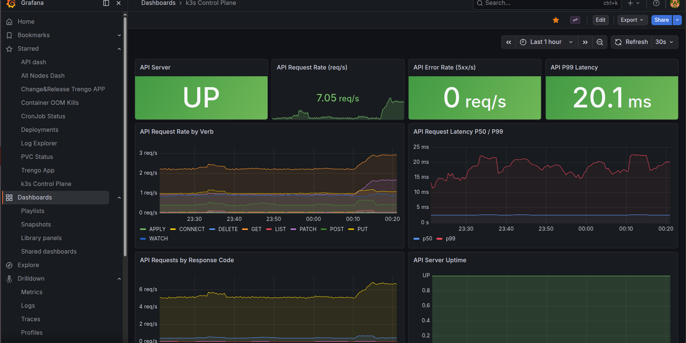 | 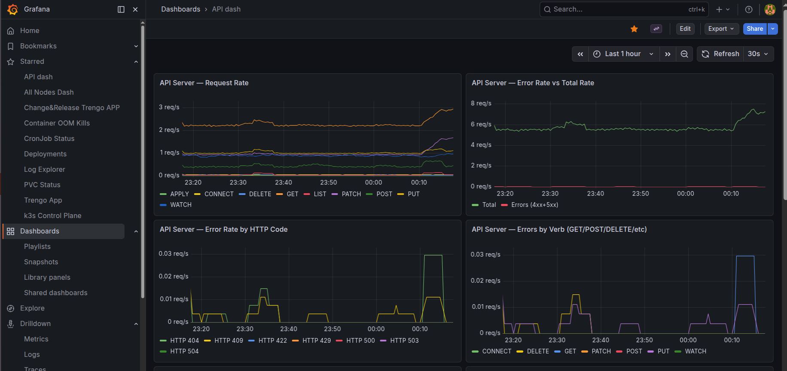 | 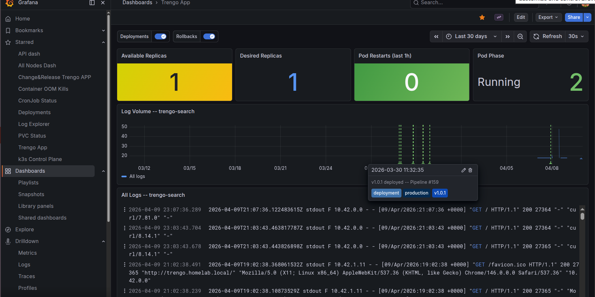 |

**Control & Health**

| Control Panel TUI | check-lab.sh output |
|---|---|
| 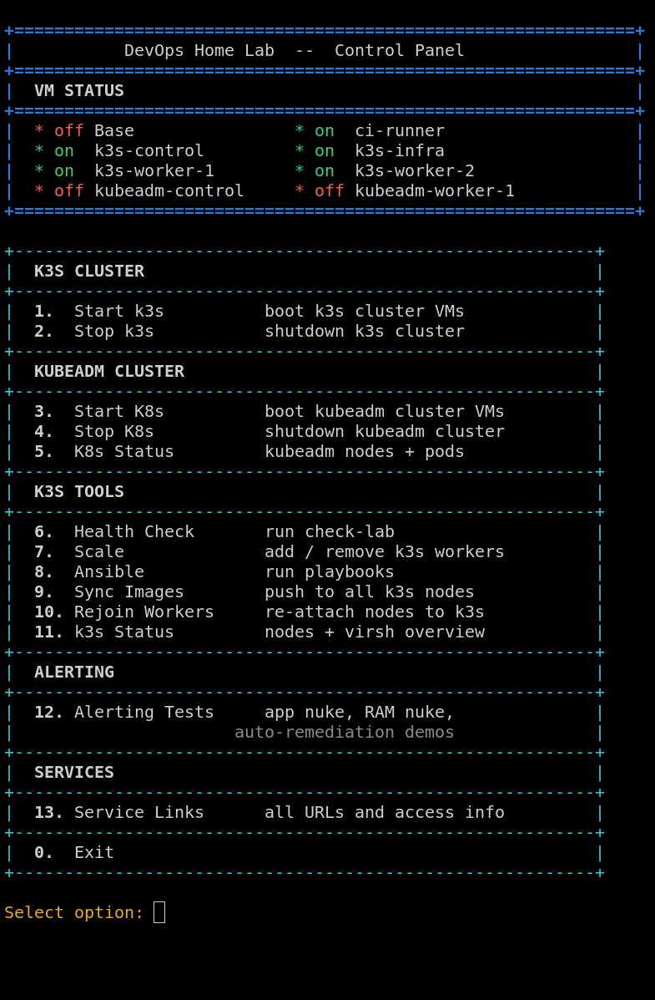 | 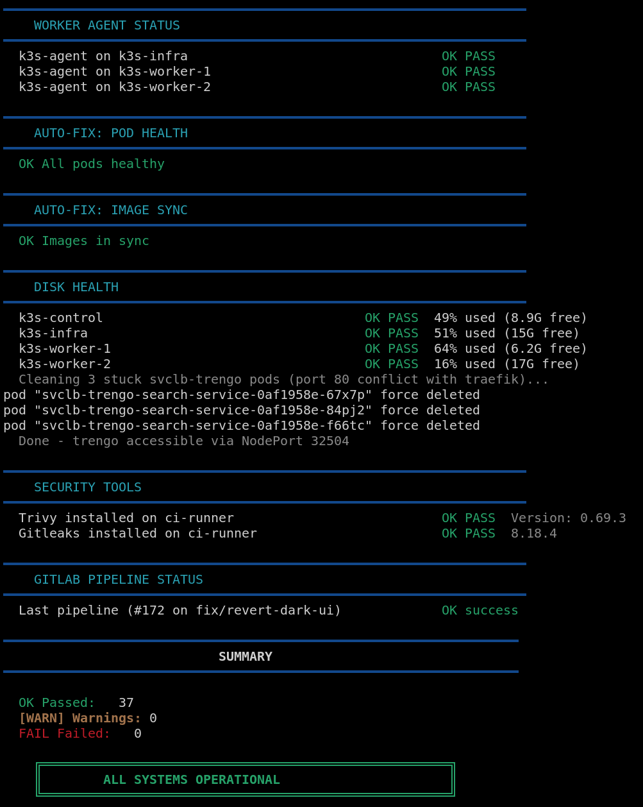 |

**CI/CD & GitLab**

| Pipeline visualized | Pipeline validation with job code | Merge requests with checklists | GitLab Issues from Alertmanager |
|---|---|---|---|
| 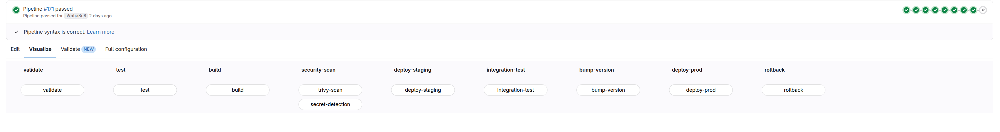 | 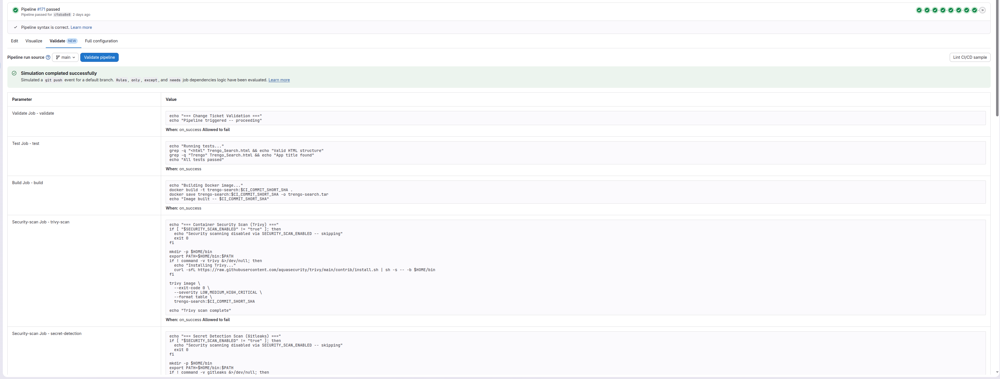 | 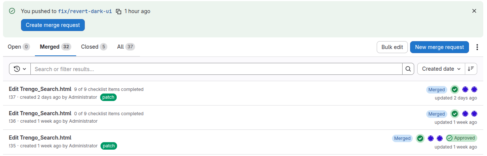 | 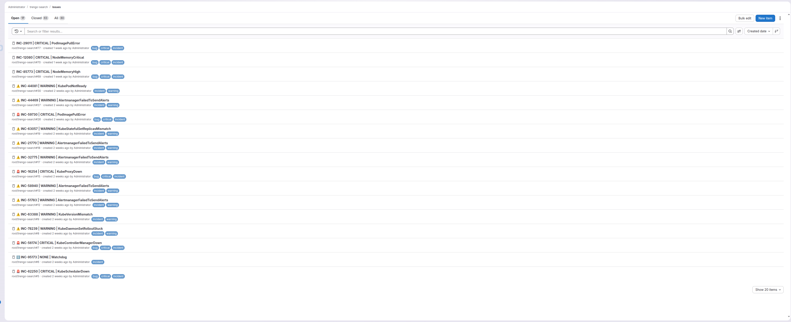 |

**Alerting**

| Slack alert |
|---|
| 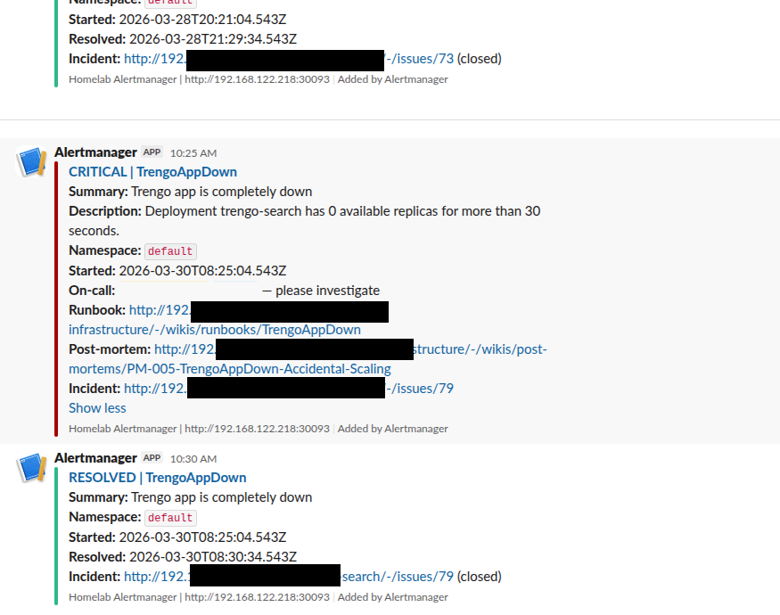 |

**Claude AI Auto-healing**

| Claude diagnosis in Slack | One-click auto-heal approved and resolved |
|---|---|
| 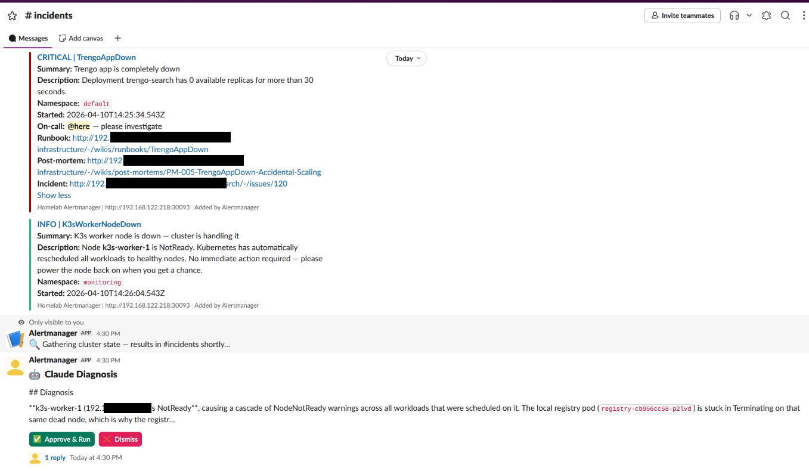 | 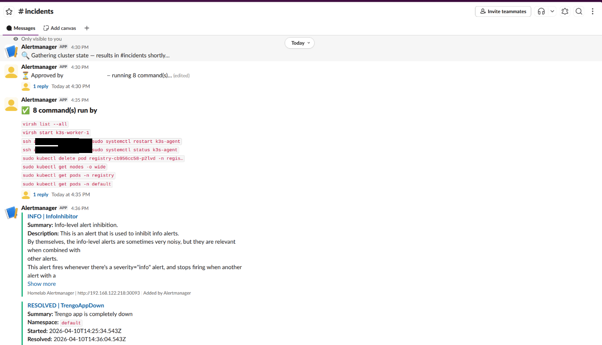 |

---

## What's in here

| Layer | Tech |
|---|---|
| VM provisioning | Terraform + libvirt provider |
| Configuration management | Ansible |
| Container orchestration | k3s (SQLite, snapshots every 12h) |
| CI/CD | GitLab CE (self-hosted) + `.gitlab-ci.yml` |
| Monitoring | Prometheus + Grafana + Loki (31d retention) + Alertmanager |
| Alerting | 20+ custom rules, auto-diagnosis via Claude AI |
| Incident management | Slack + GitLab Issues (auto-open/close) + runbooks |
| Backups | k3s state, Vaultwarden, GitLab — daily CronJobs |
| Secrets | Vaultwarden (self-hosted) |
| Registry | Local Docker registry — NFS-backed persistent storage |
| Security | NetworkPolicy, RBAC, image SHA pinning, PodDisruptionBudgets |

---

## Cluster layout

```
Host machine (KVM/libvirt, 32GB RAM)
├── k3s-control    .218   2 vCPU / 2GB   control plane
├── k3s-worker-1   .219   2 vCPU / 2GB   workloads
├── ci-runner      .220                    GitLab shell runner
├── k3s-worker-2   .221   2 vCPU / 2GB   workloads (dynamic, Terraform-managed)
└── k3s-infra      .230   2 vCPU / 8GB   GitLab CE + monitoring stack + NFS
```

All IPs are in the default libvirt NAT range (`192.168.122.0/24`). Set `base_ip_octet` in `terraform.tfvars` if yours is different.

Additional workers (`k3s-worker-3`, ...) are spun up on demand via Terraform. GitLab runs on `k3s-infra`; CI jobs execute on the dedicated `ci-runner` VM.

> **Known limitation:** All VMs run on a single KVM host. This is intentional for a homelab but means the physical host is a single point of failure. Full recovery from host loss is documented in the [disaster recovery runbook](docs/runbooks/disaster-recovery/).

---

## Repo structure

```
ansible/
  inventory/         hosts files for k3s and kubeadm clusters
  playbooks/         bootstrap, hardening, app installs

kubernetes/
  deployments/       k8s manifests (registry, NFS, pylab, vaultwarden, traefik...)
  backup/            CronJobs — k3s SQLite snapshot, Vaultwarden, GitLab
  policies/          NetworkPolicies (default-deny), PodDisruptionBudgets

monitoring/
  fix-values.yaml              Helm overrides for kube-prometheus-stack + Loki
  grafana/
    homelab-alerts.yaml        20+ custom Prometheus alert rules
    dashboards/                per-service Grafana dashboards
    datasources/

docs/
  runbooks/          13 runbooks — nodes, storage, apps, DR with RTO/RPO table
    control-plane/
    nodes/
    storage/
    applications/    pod-crashloop, image-pull, registry-down, secret-rotation
    monitoring/
    disaster-recovery/

scripts/
  webhook.py        Alertmanager → Claude AI → Slack → GitLab incident bridge
  lab-control.py    main control panel — start/stop VMs, deploy, run scenarios
  lab-tui.py        Textual TUI version of the above
  check-lab.sh      read-only health check with explicit remediation modes
  deploy.sh         build and push the trengo-search app

tests/
  test_webhook.py   unit tests — command allowlist/blocklist, Slack signature verification

terraform/          k3s worker VMs (dynamic scale)
terraform-kubeadm/  standalone kubeadm cluster (separate experiment, not connected to main lab)
```

---

## Getting started

### Prerequisites

- KVM/libvirt on the host
- Terraform >= 1.0
- Ansible >= 2.12
- `kubectl`, `k3s`, `virsh` on PATH

### 1. Provision VMs

```bash
cp terraform/terraform.tfvars.example terraform/terraform.tfvars
# edit terraform.tfvars — set your SSH public key and desired worker count
cd terraform
terraform init && terraform apply
```

### 2. Bootstrap the cluster

```bash
cd ansible
ansible-playbook -i inventory/homelab.ini playbooks/bootstrap.yml
ansible-playbook -i inventory/homelab.ini playbooks/install-apps.yml
```

### 3. Deploy monitoring

```bash
helm repo add prometheus-community https://prometheus-community.github.io/helm-charts
helm upgrade --install monitoring prometheus-community/kube-prometheus-stack \
  -n monitoring --create-namespace \
  -f monitoring/fix-values.yaml
```

### 4. Control panel

```bash
python3 scripts/lab-control.py   # menu-driven
python3 scripts/lab-tui.py       # TUI (requires: pip install textual)
./scripts/check-lab.sh            # read-only health report
./scripts/check-lab.sh --fix      # apply in-place remediations
./scripts/check-lab.sh --restart  # graceful VM restart, then remediate
./scripts/check-lab.sh --reboot   # force VM reboot, then remediate
./scripts/k3s-start.sh             # start control plane and workers
./scripts/k3s-stop.sh              # gracefully stop control plane and workers
./scripts/ci-runner.sh start        # manage the CI runner independently
./scripts/lab-stop-all.sh          # also stop ci-runner; never stops k3s-infra
```

---

## Secrets

Secrets (`K3S_TOKEN`, `GITLAB_TOKEN`, ...) are pulled from environment variables or Vaultwarden via the Bitwarden CLI. See `scripts/load-secrets.sh` for the bootstrap flow and `scripts/setup-vault.sh` to set Vaultwarden up from scratch.

The secret rotation procedure for all 5 cluster secrets is documented in [`docs/runbooks/applications/secret-rotation.md`](docs/runbooks/applications/secret-rotation.md). No Secret manifests live in git — in-cluster secrets are created from the `.yaml.example` templates (`alertmanager-webhook.yaml`, `pylab-secrets.yaml.example`, ...) and never committed with real values.

---

## Backups

All stateful components are backed up automatically via Kubernetes CronJobs defined in `kubernetes/backup/`.

| What | How | Schedule | Retention |
|---|---|---|---|
| k3s cluster state (SQLite) | `sqlite3 .backup` hot-copy via SSH | Every 12h | 14 snapshots |
| Vaultwarden | `sqlite3 .backup` from NFS-mounted PVC | Daily 02:00 | 30 days |
| GitLab (repos, issues, CI, wikis) | `gitlab-backup create` via SSH | Daily 03:00 | 7 backups |

Restore procedures for each component are documented in the [runbooks](docs/runbooks/).

**RPO:** ≤ 12h for cluster state, ≤ 24h for application data.
**RTO:** ~2h for full cluster rebuild from scratch (documented in disaster recovery runbook).

---

## Security

**NetworkPolicy** — default-deny applied in all namespaces. Explicit allow-rules cover Traefik ingress, inter-namespace registry pulls, and Prometheus scrape paths. Policies live in `kubernetes/policies/`.

**RBAC** — each workload has a dedicated ServiceAccount with least-privilege roles. `automountServiceAccountToken: false` is set by default; tokens are only mounted where explicitly required. The `webhook.py` ServiceAccount is scoped to read-only pod/node access; command execution is routed via SSH with a dedicated key, not via the Kubernetes API.

**Supply-chain controls** — CI validation and deployment tools use immutable SHA256 image digests. Critical third-party workloads such as Vaultwarden are digest-pinned; locally built application images remain an explicit exception and are tracked as future hardening work.

**PodDisruptionBudgets** — applied to Traefik and pylab to prevent accidental full-cluster downtime during rolling updates.

**Webhook security** — Slack request signatures are validated on every inbound payload using `SLACK_SIGNING_SECRET`. Approve & Run is gated by `SLACK_APPROVERS`, a comma-separated allowlist of Slack usernames; users outside the list are denied and the attempt is logged. The webhook endpoint is not exposed to the internet; it is accessible only within the cluster via a ClusterIP service and Traefik ingress restricted to the internal network.

**LLM command hardening** — Claude's suggested commands are parsed server-side: only `kubectl`, `k3s`, `ssh`, `virsh` and `docker` commands pass, shell metacharacters (`;`, `|`, `&`, backticks, `$(`) are rejected, and reads of secrets, tokens, private keys or `node-token` are blocked — independently of what the prompt asks for. Defense in depth: the prompt forbids it, the parser enforces it.

**SSH host-key pinning** — Ansible inventories and the auto-healing webhook verify SSH host keys (`StrictHostKeyChecking=yes`) against pinned keys. Keys are read out-of-band through the QEMU guest agent (`scripts/homelab-known-hosts.sh`, `scripts/kubeadm-known-hosts.sh`), so a rogue host on the libvirt bridge cannot substitute its own key.

**Secret rotation** — documented procedure for rotating all 5 cluster secrets: `docs/runbooks/applications/secret-rotation.md`.

---

## Alerting & Claude AI Auto-healing

Most homelabs (and plenty of production setups) stop at "alert fires → someone gets paged". This goes further: when an alert fires, Claude AI reads the live cluster state, diagnoses the root cause, and posts a fix to Slack with a single **Approve & Run** button. One click and the remediation runs automatically — rebuilding missing images, restarting VMs, rolling back deployments — without ever opening a terminal.

Built entirely with open components: Prometheus, Alertmanager, a custom Python webhook, the Anthropic API, and Slack's Block Kit interactive messages. No third-party incident management platform required.

### How it works

```
Prometheus alert fires
       ↓
Alertmanager → webhook.py
       ↓
GitLab issue auto-created (with severity, runbook link, timeline)
       ↓
Slack notification posted (#incidents for critical/warning)
       ↓
Claude gathers live cluster state (nodes, unhealthy pods, events, registry)
       ↓
Claude posts compact diagnosis (2-sentence summary + Approve / Dismiss buttons)
Full diagnosis + suggested commands posted in thread
       ↓
Engineer clicks Approve & Run
       ↓
Commands execute automatically, routed to the right host:
  • virsh commands   → hypervisor (KVM host)
  • docker commands  → hypervisor (source code lives there)
  • kubectl commands → k3s-control with sudo
  • ssh commands     → direct from webhook pod
       ↓
Command output posted in thread
       ↓
Alert resolves → GitLab issue auto-closed → RESOLVED posted to Slack
```

### What Claude can fix automatically (one Approve click)

| Alert | Root cause Claude identifies | Fix Claude suggests |
|---|---|---|
| TrengoAppDown | Deployment scaled to 0, image pull failure, crashloop | `kubectl rollout restart`, `docker build/push` |
| PodImagePullError | Registry empty or unreachable | `docker build` + `docker push` from hypervisor source |
| K3sWorkerNodeDown | VM powered off | `virsh start k3s-worker-N` |
| PodCrashLooping | OOM, bad config, missing secret | `kubectl describe`, log fetch, rollback |
| LocalRegistryDown | Registry pod crashed | `kubectl rollout restart deployment/registry` |
| NodeMemoryCritical | stress-ng or runaway process | `pkill`, service restart |
| NodeDiskHigh | Stale container images | `crictl rmi --prune` |

### Slack message design

Alerts and diagnoses are kept compact in the channel — full details expand in a thread:

- **Alert notification** — severity badge, summary, runbook link, GitLab incident link
- **Claude diagnosis** — 2-sentence summary + Approve & Run / Dismiss buttons in channel; full diagnosis + all commands in thread. Approve & Run honours the `SLACK_APPROVERS` allowlist — only listed engineers can execute remediation
- **Command output** — list of commands run in channel; full stdout/stderr in thread
- **Resolution** — RESOLVED notification with duration, incident link auto-closed

Alert rules live in `monitoring/grafana/homelab-alerts.yaml`. The webhook bridge is `scripts/webhook.py`.

---

## Runbooks

14 runbooks in `docs/runbooks/` covering every alert category:

| Category | Runbooks |
|---|---|
| Control plane | API server down |
| Nodes | Worker not ready, memory pressure, disk full |
| Storage | NFS server down, PVC pending |
| Applications | Pod crashloop, image pull error, registry down, Trengo app down, secret rotation |
| Monitoring | Monitoring stack down, webhook receiver down |
| Disaster recovery | Full cluster recovery (RTO ~2h, RPO ≤24h) |

Each runbook includes: symptoms, immediate triage steps, root cause checklist, resolution steps, and a verification procedure.

---

## CI/CD

`.gitlab-ci.yml` stages run on the self-hosted GitLab runner VM. GitHub pull requests also run `.github/workflows/validate.yml`, giving the public mirror the same core syntax, Terraform, Kubernetes, Prometheus, and secret-leak checks.

| Stage | Tools | What it checks |
|---|---|---|
| lint | yamllint, ShellCheck, Python compile, `terraform fmt` | YAML/shell/Python syntax and Terraform formatting |
| validate | kubeconform, promtool, `terraform validate` | All deployable manifest schemas, alert rules, and both Terraform roots |
| security | gitleaks, kubesec, Snyk IaC | Secret leaks in the full change range and Kubernetes/IaC security findings |
| deploy | `kubectl apply`, `helm upgrade` | Applied to cluster — manual gate required on `main` |
| smoke test | curl, `kubectl rollout status` | Endpoint reachability, rollout completion |

Merge requests require a 9-point checklist and at least one approval before merge to `main`.

---

## Known limitations & future work

- **Single KVM host** — all VMs share one physical machine; host failure requires full rebuild (documented in DR runbook)
- **No GitOps operator** — cluster state is applied via CI/CD push rather than continuously reconciled by ArgoCD or FluxCD
- **SQLite k3s backend** — appropriate for this scale; etcd would be required for a true HA control plane
- `terraform-kubeadm/` is a standalone experiment for learning kubeadm; it is not connected to the main lab

---

## License

MIT
